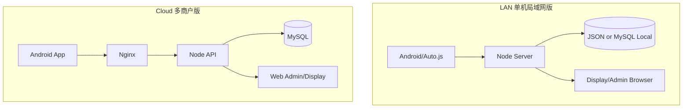
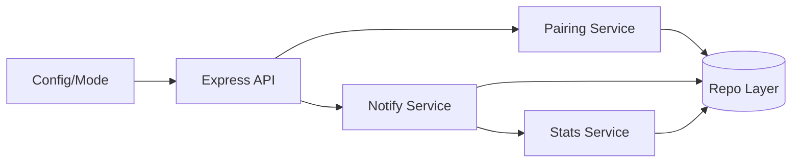
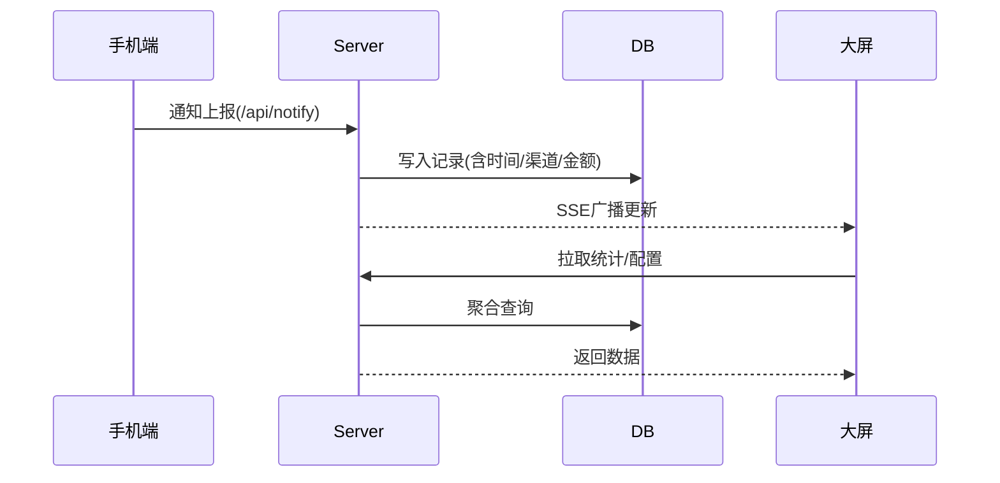

# DESIGN_双版本部署

## 总体架构

## 分层设计

- 接入层：Nginx/Express 路由、鉴权、限流（云版）。
- 业务层：配对、通知处理、统计聚合、设备在线状态。
- 数据层：
  - LAN：本地文件或本地 MySQL。
  - CLOUD：MySQL + 租户隔离。

## 模块依赖关系

## 接口契约（新增/约束）

- 通用：
  - `GET /api/health`：增加返回 `deployMode`、`recordsBackend`。
- 云版建议新增：
  - `POST /api/auth/login`
  - `GET /api/auth/me`
  - `POST /api/tenant/device/pair-session`
  - `POST /api/tenant/device/claim`
  - `POST /api/tenant/notify`
- 数据隔离原则：
  - 所有云版业务查询必须附带 `tenant_id` 条件。

## 数据流向

## 异常处理策略

- 连接失败：客户端离线队列 + 重试。
- 租户鉴权失败：返回 `401/403`，不落库。
- MySQL 故障：
  - LAN：可降级 JSON（可配置）。
  - CLOUD：不降级，直接告警，防止数据分裂。
- 配对会话过期：二维码自动刷新重建。

## 宝塔部署设计

- 目录建议：
  - `/www/wwwroot/notify-pro`
- 进程管理：
  - PM2 进程名：`notify-pro-lan` 或 `notify-pro-cloud`
- Nginx：
  - `cloud` 使用域名与 SSL
  - `lan` 可选仅内网 IP 访问
- MySQL：
  - 执行 `docs/mysql_init.sql` + 云版多租户扩展脚本（后续任务实现）
