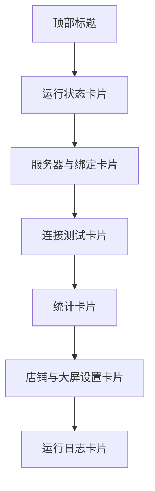

# DESIGN_移动端审查与UI重构

## 页面结构

## 交互设计要点

- 关键操作前置：扫码绑定、通知权限、电池设置、打开后台。
- 输入控件集中：服务器地址 + 管理员密码 + 店铺配置。
- 状态可见：连接测试结果、运行状态、日志实时刷新。

## 数据与接口

- `GET /api/settings`：读取店铺配置与备份参数。
- `POST /api/settings`：写入店铺配置与备份参数（带管理员密码头）。
- `GET /api/records`：读取统计快照。
- `GET /api/connection/status`：读取在线状态。

## 异常策略

- 管理员密码错误：toast 反馈 + 日志记录。
- 网络失败：保留原输入，不清空，提示重试。
