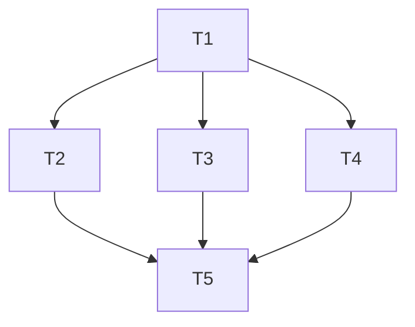

# TASK_单租户商用加固

## 原子任务

### T1 文件写入可靠性
- 输入：现有 `readJson/writeJson`
- 输出：原子写入实现
- 验收：语法通过，服务可正常写配置与记录

### T2 备份能力
- 输入：`data/*.json`
- 输出：手动触发备份接口 + 自动轮转
- 验收：可生成备份目录并返回结果

### T3 诊断能力
- 输入：系统信息、配对状态、存储状态
- 输出：`/api/diagnostics`
- 验收：返回明确 checks/warnings/errors

### T4 CSV 导出
- 输入：记录数据
- 输出：`/api/records/export.csv`
- 验收：可下载可读 CSV

### T5 文档同步与验收
- 输入：实现结果
- 输出：README/部署文档 + ACCEPTANCE/FINAL/TODO
- 验收：文档与实现一致

## 依赖图

