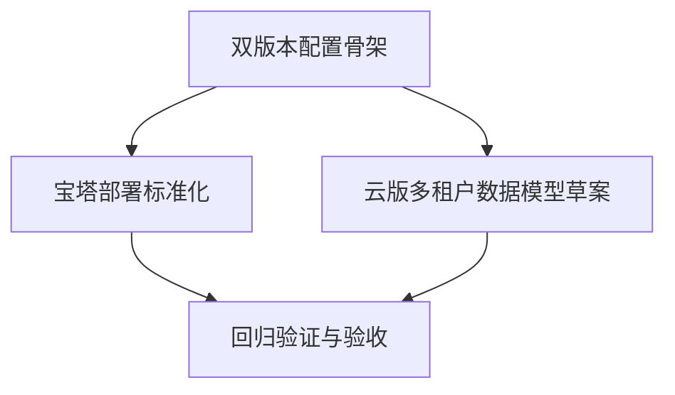

# TASK_双版本部署

## 原子任务

### T1 双版本配置骨架

- 输入契约：
  - 现有 `server.js`、启动脚本可运行
- 输出契约：
  - 支持 `DEPLOY_MODE=lan|cloud`
  - 新增 LAN/CLOUD 环境模板
- 实现约束：
  - 不破坏当前 API 路径
  - 默认行为保持兼容
- 依赖关系：
  - 无前置，后续任务依赖 T1

### T2 宝塔部署标准化

- 输入契约：
  - T1 已支持模式配置
- 输出契约：
  - 宝塔安装文档
  - 启动/重启/日志/升级 SOP
- 实现约束：
  - 支持无开发环境运维人员执行
- 依赖关系：
  - 依赖 T1

### T3 云版多租户数据模型草案

- 输入契约：
  - MySQL 已可用
- 输出契约：
  - tenant/user/device/record 表结构设计文档或 SQL 草案
  - API 鉴权与 tenant 过滤约束
- 实现约束：
  - 不直接破坏 LAN 表结构
- 依赖关系：
  - 依赖 T1

### T4 回归验证与验收

- 输入契约：
  - T1~T3 完成
- 输出契约：
  - `ACCEPTANCE_双版本部署.md`
  - 功能回归结果与风险清单
- 实现约束：
  - 至少覆盖：配对、通知上报、统计展示、模式切换
- 依赖关系：
  - 依赖 T1/T2/T3

## 任务依赖图

