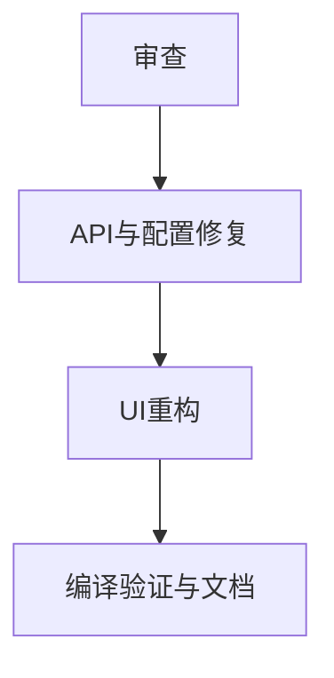

# TASK_移动端审查与UI重构

## 原子任务

1. 审查与问题清单
- 输出 bug/一致性问题列表，标注文件位置与风险级别。

2. API 与配置模型修复
- `NotifyApi.kt`：新增管理员密码透传、备份参数字段。
- `ConfigStore.kt`：存储管理员密码。
- `MainActivity.kt`：加载/保存管理员密码、保存设置时透传。

3. UI 重构
- `activity_main.xml`：按卡片分区重建布局。
- `strings.xml`：补齐新增字段文案。

4. 编译验证与文档
- 执行 Kotlin 编译检查。
- 输出 `ACCEPTANCE/FINAL/TODO`。

## 依赖图

