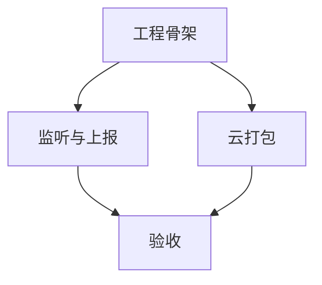

# TASK_自研APK

## 原子任务拆解

1. Android 工程骨架
- 输入：仓库根目录
- 输出：`app` 模块、Gradle 配置、Manifest、基础 UI

2. 通知监听与上报
- 输入：服务器 API 协议
- 输出：`NotifyListenerService.kt`、`NotifyApi.kt`

3. 云打包流水线
- 输入：GitHub Actions
- 输出：`android-debug.yml`、`android-release.yml`

4. 交付文档
- 输入：6A 流程要求
- 输出：Alignment/Consensus/Design/Task/Acceptance 文档

## 依赖关系

